### Hi there 👋

## Languages and Tools:

#### Languages:

<p align="left">
  
</p>

#### Databases:
 <p align="left">
  
  
</p>

#### Frameworks:
<p align="left">
  
  
</p>

#### OS:
<p align="left">
  
  
  
  
</p>  

#### IDEs:
<p align="left">
  
  
</p>
<p>

[](https://discord.com/users/602846728147959808)
  
</p>

<br />
<br />

<!--START_SECTION:waka-->

```txt
Total Time: 46 hrs 27 mins

TypeScript                 25 hrs 51 mins  █████████████▓░░░░░░░░░░░   55.10 %
JSON                       5 hrs 47 mins   ███░░░░░░░░░░░░░░░░░░░░░░   12.35 %
MDX                        5 hrs 38 mins   ███░░░░░░░░░░░░░░░░░░░░░░   12.03 %
Python                     5 hrs 29 mins   ███░░░░░░░░░░░░░░░░░░░░░░   11.69 %
YAML                       2 hrs 29 mins   █▒░░░░░░░░░░░░░░░░░░░░░░░   05.32 %
```

<!--END_SECTION:waka-->

## 📊 GitHub Stats



<div align="center">
  
</div>

<div align="center">
  
</div>

<p align="right">
  
</p>

[](https://wakatime.com/@018e2a7e-0f00-4f94-bc1d-2b772065ca16)
